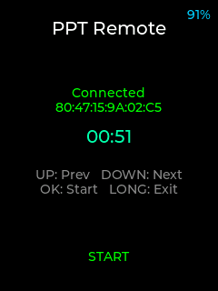

# AI Passport PPT Remote · PPT 翻页遥控器


基于 [FoloToy AI Passport](https://github.com/FoloToy/ai-passport) 的蓝牙遥控器固件：把通行证变成一支**无线翻页笔**，站着也能掌控节奏。

设备通过蓝牙向电脑模拟**标准键盘**——方向键翻页、F5 放映、Esc 退出，兼容所有主流 PPT 软件。

## 功能一览

| 按键 | 操作 | 效果 |
|------|------|------|
| 上键 | 短按 | 上一页 (`←`) |
| 下键 | 短按 | 下一页 (`→`) |
| 确认键 | 短按 | 进入放映 (`F5`) + 启动演讲计时器 |
| 确认键 | 长按 | 退出放映 (`Esc`) + 停止计时器 |

屏幕实时显示：电池电量（右上，BAT 前缀）、蓝牙连接状态、演讲计时器、当前操作反馈。

**设备界面实拍**：



## 使用方法

1. 烧录固件后设备自动开启蓝牙广播
2. 电脑 **蓝牙设置** 中搜索并配对 `PPT-Remote`
3. 打开 PowerPoint / WPS / LibreOffice / Keynote，按键即可遥控

> 更换固件后如按键失效，请在电脑蓝牙中忽略旧配对后重新配对。

## 快速上手（完整安装教程）

### 1. 安装 ESP-IDF

需要 [ESP-IDF v5.x](https://docs.espressif.com/projects/esp-idf/zh_CN/latest/esp32c3/get-started/)。

**Windows**：下载 [离线安装器](https://dl.espressif.com/dl/esp-idf/)，安装后打开 ESP-IDF 终端。

**Linux/macOS**：
```bash
git clone -b v5.5.3 --recursive https://github.com/espressif/esp-idf.git ~/esp/esp-idf
cd ~/esp/esp-idf && ./install.sh esp32c3
. $HOME/esp/esp-idf/export.sh
```

### 2. 获取代码 & 编译

```bash
git clone https://github.com/YeatsLiao/ai-passport-ppt.git
cd ai-passport-ppt
idf.py set-target esp32c3
idf.py build
```

### 3. 烧录

```bash
# Windows: 将 COM3 替换为实际串口号（设备管理器中查看）
idf.py -p COM3 flash monitor

# Linux/macOS
idf.py -p /dev/ttyACM0 flash monitor
```

### 4. 配对

- **Windows**: 设置 → 蓝牙 → 添加设备 → 搜索 `PPT-Remote` → 配对
- **macOS**: 系统设置 → 蓝牙 → 找到 `PPT-Remote` → 连接
- **Linux**: `bluetoothctl` → `scan on` → `pair <MAC>` → `connect <MAC>`

详细安装教程、故障排查、技术架构说明见 [完整技术文档](docs/README.md)。

## 项目架构

```
├── main/
│   ├── main.c          # UI、按键分发、演讲计时器、状态刷新
│   ├── ble_hid.h       # HID Keyboard 接口
│   ├── ble_hid.c       # BLE Keyboard HID 服务 + 按键任务
│   └── CMakeLists.txt
├── components/bsp/     # AI Passport 官方硬件驱动 (按键/屏幕/电池等)
├── docs/
│   ├── README.md       # 完整技术文档 (环境安装/编译/配对/故障排查)
│   └── development-log.md
├── sdkconfig.defaults
└── partitions.csv
```

核心技术：BLE HID **Boot Keyboard**（8 字节标准键盘报告），全平台免驱。详见 [开发文档](docs/README.md)。

## 构建预编译固件（可选）

```bash
idf.py build
idf.py merge-bin
copy build\merged-binary.bin ai-passport-ppt-full.bin
```

**固件命名**：`ai-passport-ppt-full.bin`

- `full` = 从 `0x0` 整片烧录的合并镜像（含 bootloader + 分区表 + 应用）
- 由 `idf.py merge-bin` 生成 `build/merged-binary.bin` 后重命名，版本 v1.0.0

烧录预编译固件：

```bash
esptool.py --chip esp32c3 -p COM3 --baud 460800 write_flash 0x0 ai-passport-ppt-full.bin
```

## 文档

- [完整技术文档](docs/README.md)：环境安装、编译烧录、配对连接、故障排查、架构详解
- [开发日志](docs/development-log.md)：设计决策与方案演进

## 致谢

- [FoloToy AI Passport](https://github.com/FoloToy/ai-passport) — 硬件平台与 BSP 组件
- [ai-passport-tiktok-remote](https://github.com/YeatsLiao/ai-passport-tiktok-remote) — 架构参考

## 许可证

MIT

---

# AI Passport PPT Remote (English)


A Bluetooth remote firmware for [FoloToy AI Passport](https://github.com/FoloToy/ai-passport) that turns the badge into a **PPT clicker** — control your presentation from the podium.

The device talks to your PC over Bluetooth by emulating a **standard keyboard** — arrow keys for navigation, F5 to start slideshow, Escape to exit.

## Features

| Button | Action | Effect |
|--------|--------|--------|
| Up | Click | Previous slide (`←`) |
| Down | Click | Next slide (`→`) |
| OK | Click | Start slideshow (`F5`) + start timer |
| OK | Long press | Exit slideshow (`Esc`) + stop timer |

The screen shows battery level with a BAT prefix (top-right), Bluetooth connection status, presentation timer, and the last action.

**On-device UI**:


## Quick Start

1. Flash the firmware; the device starts advertising automatically
2. Pair `PPT-Remote` in your PC's Bluetooth settings
3. Open PowerPoint / WPS / LibreOffice / Keynote and press buttons

> After a firmware change, forget the old pairing on your PC and pair again.

## Build & Flash

Requires [ESP-IDF](https://docs.espressif.com/projects/esp-idf/en/latest/esp32c3/) v5.x (ESP32-C3 target).

```bash
git clone https://github.com/YeatsLiao/ai-passport-ppt.git
cd ai-passport-ppt
idf.py set-target esp32c3
idf.py build
idf.py -p COM3 flash monitor   # Replace COM3 with your serial port
```

For detailed installation guide, troubleshooting, and architecture details, see [full documentation](docs/README.md).

## License

MIT
